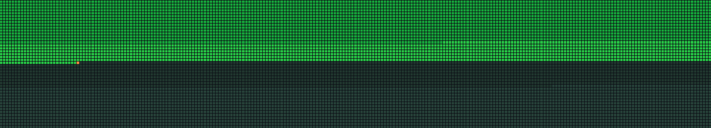

# Mori



Nothing like a grid of tiny squares to remind you that time is, in fact, not on your side. Momento Mori is an end-of-life visualizer that shows every day from birth to your (optimistic) expiry date as a GitHub-style activity graph. Green blocks are days you've used up. Dark blocks are what's left. The orange dot is you, right now, wondering where the time went.

It's cheerful like that.

## Usage

Open `index.html` in a browser. That's it. No build step, no dependencies, no existential crisis management toolkit included.

## Query Parameters

Everything is configured via the URL, so you can bookmark your mortality or share it with friends.

| Parameter | Default | Description |
|-----------|---------|-------------|
| `birth` | `1971-06-28` | Your birthday in `YYYY-MM-DD` format |
| `end` | `80` | The age you're betting you'll reach |
| `from` | `50` | Starting age for the "midlife crisis" view |
| `mode` | `whole` | Active view: `whole`, `from40`, `decade`, or `birthday` |

### Examples

```
# Default (born June 28 1971, hoping for 80)
index.html

# Born in 1990, aiming for 100 (ambitious)
index.html?birth=1990-05-15&end=100&from=30&mode=whole

# Just show me this decade, I can't handle the big picture
index.html?birth=1971-06-28&end=80&from=50&mode=decade
```

## Views

- **0 -> 80** - Your whole life. All of it. Every single day. You're welcome.
- **50 -> 80** - From a configurable starting age to the end. For when the first half is just backstory.
- **50's** - Your current decade. A more digestible existential window.
- **54 -> 55** - Current age to next birthday. A countdown to cake, basically.

## License

MIT - because even mortality should be open source.
